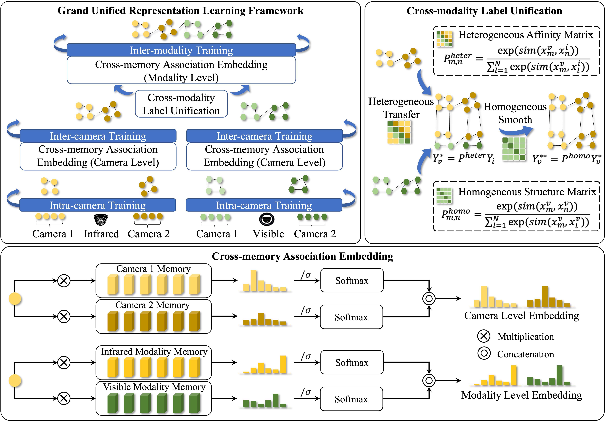

# Towards Grand Unified Representation Learning for Unsupervised Visible-Infrared Person Re-Identification

The *official* repository for [Towards Grand Unified Representation Learning for Unsupervised Visible-Infrared Person Re-Identification](https://openaccess.thecvf.com/content/ICCV2023/papers/Yang_Towards_Grand_Unified_Representation_Learning_for_Unsupervised_Visible-Infrared_Person_Re-Identification_ICCV_2023_paper.pdf). We achieve state-of-the-art performances on **unsupervised visible-infrared person re-identification** task.

**Our unified framework**


# Highlight

1. We propose a novel unsupervised learning framework that adopts a bottom-up domain learning strategy with cross-memory association embedding. This enables the model to learn unified representation which is robust against hierarchical discrepancy.
2. We design a cross-modality label unification module to propagate and smooth labels between two modalities with heterogeneous affinity matrix and homogeneous structure matrix, respectively, unifying the identities across the two modalities.
3. Extensive experiments on the SYSU-MM01 and RegDB datasets demonstrate that our GUR framework significantly outperforms existing USL-VI-ReID methods, and even surpasses some supervised counterparts, further narrowing the gap between supervised and unsupervised VI-ReID. 

# Prepare Datasets
Put SYSU-MM01 and RegDB dataset into data/sysu and data/regdb, run prepare\_sysu.py and prepare\_regdb.py to prepare the training data (convert to market1501 format).

# Training

We utilize 4 V100 GPUs for training.

**examples:**

SYSU-MM01:

1. Train:
```shell
sh sba_train_sysu.sh
```


2. Test:
```shell
sh sba_test_sysu.sh
```

RegDB:

1. Train:
:
```shell
sh sba_train_regdb.sh
```

2. Test:
```shell
sh sba_test_regdb.sh
```


# Citation
This code is based on previous work [ADCA](https://github.com/yangbincv/ADCA.). 
If you find this code useful for your research, please cite our papers.

```
@InProceedings{Yang_2023_ICCV,
    author    = {Yang, Bin and Chen, Jun and Ye, Mang},
    title     = {Towards Grand Unified Representation Learning for Unsupervised Visible-Infrared Person Re-Identification},
    booktitle = {Proceedings of the IEEE/CVF International Conference on Computer Vision (ICCV)},
    month     = {October},
    year      = {2023},
    pages     = {11069-11079}
}

@inproceedings{adca,
  title={Augmented Dual-Contrastive Aggregation Learning for Unsupervised Visible-Infrared Person Re-Identification},
  author={Yang, Bin and Ye, Mang and Chen, Jun and Wu, Zesen},
  pages = {2843–2851},
  booktitle = {ACM MM},
  year={2022}
}
```

# Contact
yangbin_cv@whu.edu.cn; yemang@whu.edu.cn.


